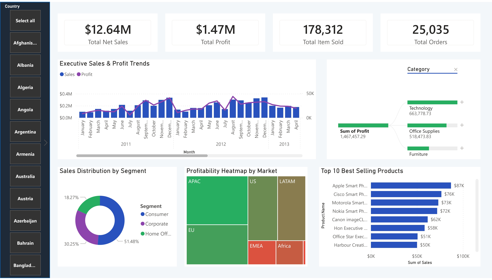

# 🛒 Global Sales & Profit Analysis

## 🎯 Project Objective
This is a proactive retail analysis dashboard to track supermarket performance. It visualizes city-level profit, identifies high-volume and high-profit product sub-categories, and analyzes sales vs. profit trends to optimize regional branch performance.

## 📸 Dashboard Snapshot

## 🛠️ Tools & Technologies Used
* **Data Visualization:** Microsoft Power BI
* **Data Preparation:** Power Query
* **Data Modeling:** DAX (Data Analysis Expressions)
* **Other Tools:** Retail Analytics

## 💡 Key Insights & Business Value
1. **Geographical Profit:** Philadelphia, Seattle, and Houston emerge as top-performing hubs, while others show lower profitability, indicating opportunities for resource reallocation.
2. **Product Performance:** Binders, Paper, and Furnishings have the highest quantity sold. Copiers, Phones, and Accessories are the most profitable sub-categories, while Tables are a primary loss factor.
3. **Trends:** Total Sales is ~$2.3M with a profit of ~$286K, indicating ~12% net profit margin for the analyzed period.

## 🚀 How to Use This Repository
1. Download the `.pbix` file to interact with the dashboard in Power BI Desktop.
2. The raw dataset used for this analysis is available in the `superstore.csv` file.
